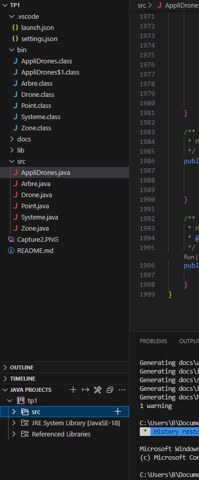
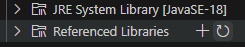
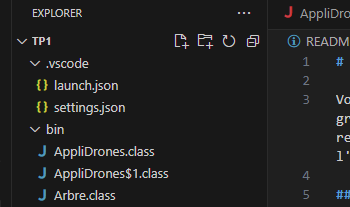
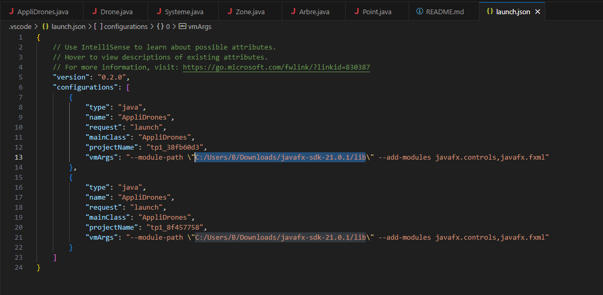
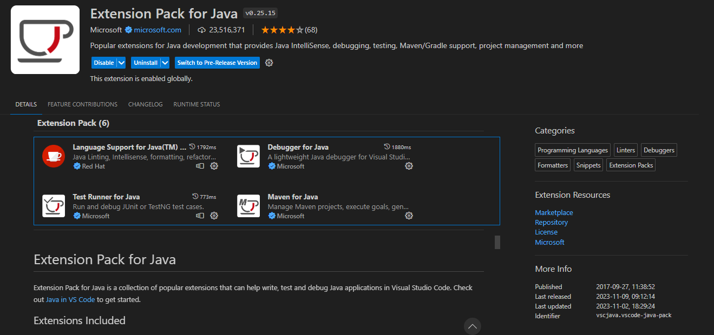
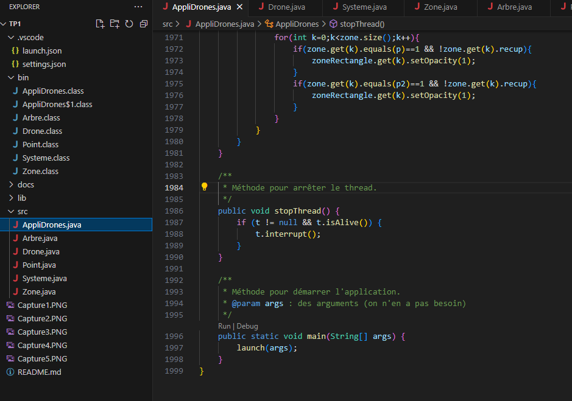
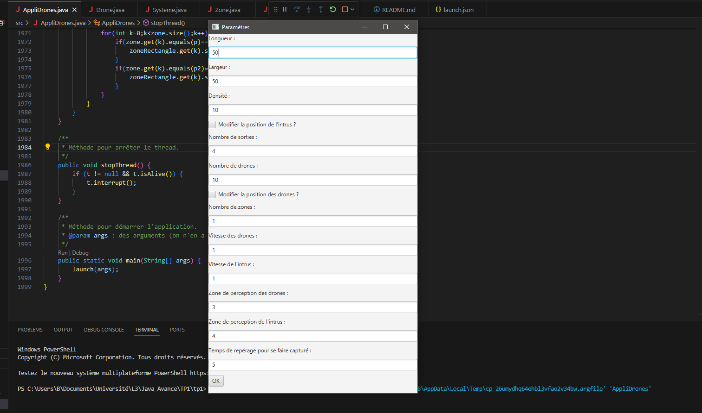
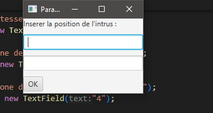
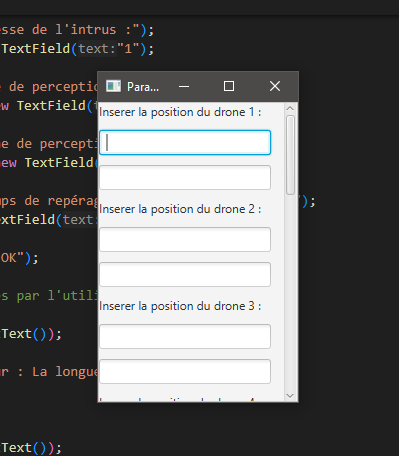

# Application de poursuite de drones

Vous êtes un intrus (en bleu clair) et vous devez récupérer une (ou plusieurs) caisses (en violet). Sur votre chemin, il aura plusieurs obstacles : des arbres, petits (vert clair) ou grands (vert foncé), qui vous bloquent le passage et des drones, normals (rouge clair) ou mégas (rouge foncé), qui peuvent vous capturer si vous êtes sur la même case ou que vous restez dans leur champ de vision trop longtemps. Les méga drones peuvent passer à travers les petits arbres. Une fois toutes les caisses récupérées, vous devez vous échapper par l'une des sorties (en jaune). Si vous réussissez à faire cela, vous gagnez.

## Table des matières

- [Installation](#installation)
    - [Téléchargement de JavaFX](#téléchargement-de-javafx)
    - [Configuration des librairies de JavaFX](#configuration-des-librairies-de-javafx)
    - [Téléchargement de l'extension pack pour Java](#téléchargement-de-lextension-pack-pour-java)
- [Utilisation](#utilisation)
    - [Démarrage du jeu](#démarrage-du-jeu)
    - [Explication des paramètres du jeu](#explication-des-paramètres-du-jeu)
        - [Fenêtre principale](#fenêtre-principale)
        - [Fenêtre de configuration de l'intrus](#fenêtre-de-configuration-de-lintrus)
        - [Fenêtre de configuration des drones](#fenêtre-de-configuration-des-drones)
- [Documentation Javadoc](#documentation-javadoc)

## Installation

### Téléchargement de JavaFX
Pour installer mon projet, il faut installer JavaFX en le téléchargeant : https://openjfk.io.

### Configuration des librairies de JavaFX
Une fois l'extraction faite, ouvrez mon projet avec VSCode et dans la petite fenêtre à gauche, dans "JAVA PROJECTS", dans "Referenced Libraries", cliquez sur le + comme le montre ces images :  
 
 
Puis ajoutez tous les fichiers dans le dossier lib du dossier JavaFX que vous avez extrait.

Ensuite, allez dans launch.json (il se trouve dans le dossier ".vscode") et remplacez tous les "C:/Users/B/Downloads/javafx-sdk-21.0.1/lib" (il se trouve dans les vmArgs) par le chemin absolu du dossier lib du dossier JavaFX que vous avez extrait. Voici deux captures d'écran pour vous aider :  
 
 

### Téléchargement de l'extension pack pour Java
Avant, veuillez installer l'extension "Extension Pack for Java" (faites une recherche sur l'onglet "Extensions" pour le trouver) :  

## Utilisation

### Démarrage du jeu
Pour utiliser l'application, allez sur AppliDrones.java et cliquez sur "Run" qui apparaît au dessus du main se trouvant en bas du code : 
 
Une fenêtre permettant de paramétrer le jeu apparaîtra.

### Explication des paramètres du jeu
#### Fenêtre principale

- **Longueur** : Représente la longueur de la map. Elle ne peut pas être inférieure à 5. C'est un entier.
- **Largeur** : Représente la largeur de la map. Elle ne peut pas être inférieure à 5. C'est un entier.
- **Densité** : Réprésente la densité des arbres sur la map en pourcentage. Elle doit être inférieure ou égale à 95%. C'est un entier positif.
- **Modifier la position de l'intrus ?** : Cochez cette case si vous voulez modifier la position de l'intrus. Pour les paramètres de la fenêtre de configuration de l'intrus : [Fenêtre de configuration de l'intrus](#fenêtre-de-configuration-de-lintrus)
- **Nombre de sorties** : Représente le nombre de sorties dans la map. Il ne peut y avoir que 1, 2, 3 ou 4 sorties.
- **Nombre de drones** : Représente le nombre de drones dans la map. C'est un entier positif.
- **Modifier la position des drones ?** : Cochez cette case si vous voulez modifier la position de l'intrus. Pour les paramètres de la fenêtre de configuration des drones : [Fenêtre de configuration des drones](#fenêtre-de-configuration-des-drones)
- **Nombre de zones** : Représente le nombre de zones dans la map. C'est un entier positif.
- **Vitesse des drones** : C'est un réel positif inférieur ou égal à 5.
- **Vitesse de l'intrus** : C'est un réel positif supérieur ou égal à 0,5.
- **Zone de perception des drones** : Représente la zone de perception des drones pour pouvoir repérer l'intrus. C'est un entier positif.
- **Zone de perception de l'intrus** : Représente la zone de perception de l'intrus pour pouvoir voir ce qui est caché dans l'obscurité sur la map (c'est-à-dire les arbres, les sorties et les zones). C'est un entier positif.
- **Temps de repérage pour se faire capturer** : Représente le temps de repérage nécessaire en secondes pour que l'intrus se fasse capturer par les drones. C'est un entier positif non nul.
#### Fenêtre de configuration de l'intrus
 
Attention, il ne peut pas avoir la même position qu'un drone. L'une des deux positions doit être entre 1 et 3 inclus ou entre la longueur/largeur - 2 et la longueur/largeur inclus.
- **Position X** : Représente la position sur l'axe X des abscisses de l'intrus. C'est un entier positif.
- **Position Y** : Représente la position sur l'axe Y des ordonnées de l'intrus. C'est un entier positif.
#### Fenêtre de configuration des drones
 
Attention, ils ne peuvent pas avoir la même position qu'un autre drone. L'une des deux positions doit être entre 1 et 3 inclus ou entre la longueur/largeur - 2 et la longueur/largeur inclus.
- **Position X** : Représente la position sur l'axe X des abscisses des drones. C'est un entier positif.
- **Position Y** : Représente la position sur l'axe Y des ordonnées des drones. C'est un entier positif.

## Documentation Javadoc
- [Documentation Javadoc](docs/index.html)